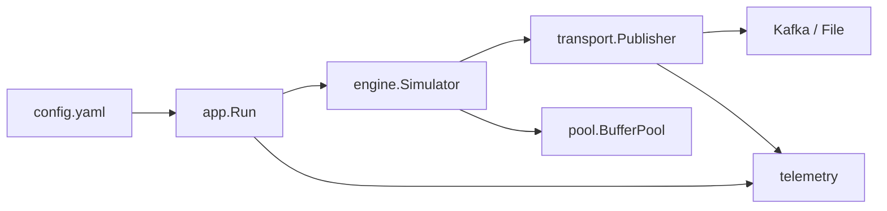
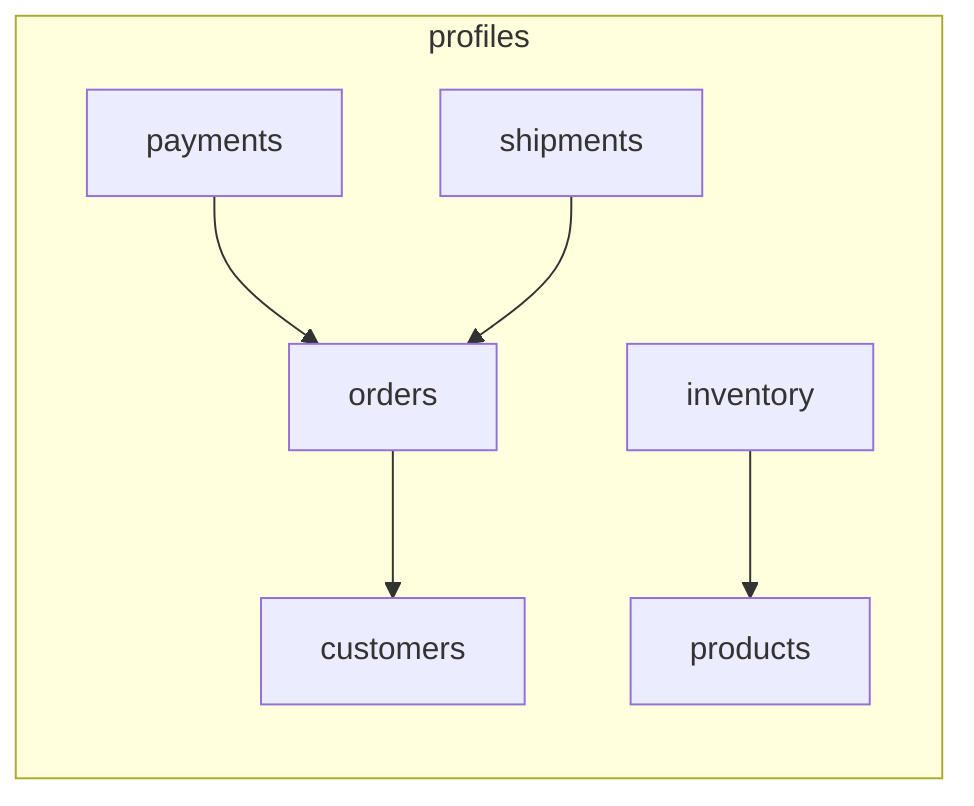

<div align="center">
  <h1>KafkaFlux</h1>
  <p><strong>Streaming Data Simulator — One Command. Any Schema.</strong></p>
  <p>
    <a href="#quick-start">Quick Start</a> •
    <a href="#download">Download</a> •
    <a href="#why-kafkaflux">Why KafkaFlux?</a> •
    <a href="#architecture">Architecture</a> •
    <a href="#features">Features</a> •
    <a href="#performance">Performance</a> •
    <a href="#data-model">Data Model</a> •
    <a href="#running">Running</a> •
    <a href="#example-profiles">Example Profiles</a> •
    <a href="#configuration">Configuration</a> •
    <a href="#production-guide">Production Guide</a> •
    <a href="#community">Community</a>
  </p>
  <p>
    
    
    
    
    
  </p>
  <p>Built by <a href="https://linkedin.com/in/prajeeshchavan"><strong>Prajeesh Chavan</strong></a></p>
</div>

---

KafkaFlux generates **realistic, high-volume event streams** to Kafka topics (or JSON/CSV files). Define your schema in YAML — orders, IoT telemetry, logs, financial transactions, user activity, or any domain — and get streaming data flowing in one command.

**Includes 30+ example profiles for ecommerce and 3 IoT profiles** to get started immediately. Bring your own schemas for anything else.

Built for **load testing**, **demo environments**, **data pipeline development**, and **CI/CD testing**.

---

## Quick Start

```sh
git clone https://github.com/prajeesh-chavan/KafkaFlux
cd KafkaFlux
docker compose up
```

That's it. Zookeeper + Kafka + the simulator start together.

**Without Kafka (JSON output):**

```sh
SIMULATOR_MODE=json go run ./cmd/producer/main.go
```

---

## Download

Pre-built binaries for each [release](https://github.com/prajeesh-chavan/KafkaFlux/releases) — no Go or Docker required.

```sh
# JSON/CSV mode (static binary, no dependencies)
curl -LO https://github.com/prajeesh-chavan/KafkaFlux/releases/latest/download/kafkaflux-producer-linux-amd64
chmod +x kafkaflux-producer-linux-amd64
SIMULATOR_MODE=json ./kafkaflux-producer-linux-amd64

# Kafka mode (requires librdkafka on the system)
curl -LO https://github.com/prajeesh-chavan/KafkaFlux/releases/latest/download/kafkaflux-producer-kafka-linux-amd64
chmod +x kafkaflux-producer-kafka-linux-amd64
./kafkaflux-producer-kafka-linux-amd64
```

Also available: `kafkaflux-generator` (profile generator), `linux-arm64` builds, and `profiles.tar.gz`.

---

## Why KafkaFlux?

Most teams write custom scripts to push test data into Kafka. Then rewrite them for the next project. Then again for the next.

KafkaFlux treats test data like **infrastructure — not a script.** Declarative YAML configs, reusable across projects, version-controllable, one command to run.

### KafkaFlux vs Custom Scripts vs Faker

| Capability | Custom Script | Python Faker | KafkaFlux |
|---|---|---|---|
| Schema as config | ❌ Hardcoded | ❌ In code | ✅ YAML, no recompile |
| Cross-entity references | ❌ Manual wiring | ❌ Impossible | ✅ State pools |
| Chaos injection | ❌ Write it yourself | ❌ | ✅ YAML toggle |
| Deterministic mode | ❌ Add seed param | ✅ Seed per generator | ✅ Seed + per-worker offset |
| Batch mode | ❌ Manual count | ❌ | ✅ Built-in, exits cleanly |
| Dynamic traffic scaling | ❌ Cron + math | ❌ | ✅ Sine wave, 0.1x–1.6x |
| Prometheus metrics | ❌ Write exporter | ❌ | ✅ Built-in |
| External dependencies | 47+ pip packages | 10+ pip | **2 Go modules** |
| Runtime | Python (100MB+ image) | Python | ~6MB static binary |
| Transport | You build it | You build it | Kafka + JSON + CSV |

---

## Architecture



### Package Map

| Package | Purpose |
|---------|---------|
| `cmd/producer` | Entrypoint — 7 lines, calls `app.Run()` |
| `cmd/generator` | CLI tool for generating/validating profile YAMLs |
| `internal/app` | Wiring: config, profiles, publisher, simulator, metrics, lifecycle |
| `internal/config` | YAML config loading, env override, profile compilation |
| `internal/engine` | Simulator, workers, state pools, sine-wave scaler, dashboard |
| `internal/field` | 50+ field generators + `CompileField` dispatcher |
| `internal/pool` | `BufferPool` interface + `SyncPool` for byte slice reuse |
| `internal/telemetry` | Structured logging (`slog`) + Prometheus/JSON metrics HTTP server |
| `internal/transport` | `DataPublisher` interface + Kafka / File implementations |

---

## Features

### Define Any Data Shape

Schemas are pure YAML. No code to write. Swap domains by swapping config files.

```yaml
# An order event — could just as easily be a sensor reading or log entry
entity: orders
topic: "telemetry.ecommerce.orders"
target_eps: 50

fields:
  order_id:
    type: uuid
    publish_to: orders
  customer_id:
    type: pool
    pool: customers
  order_status:
    type: weighted
    values:
      PLACED: 15
      CONFIRMED: 15
      SHIPPED: 20
      DELIVERED: 25
      CANCELLED: 4
      RETURNED: 1
```

### Profile Organization

Profiles live in domain subdirectories. Organize by domain, enable/disable individually, and filter at runtime.

```sh
profiles/
├── ecommerce/          # 30 entity profiles
│   ├── orders.yaml
│   ├── customers.yaml
│   └── ...
└── iot/                # 3 IoT profiles
    ├── sensors.yaml
    ├── device_events.yaml
    └── gps_tracking.yaml
```

```yaml
# config.yaml
simulator:
  profiles: ["orders", "iot/*"]   # runtime filter by entity name + glob
```

Per-profile options:
```yaml
entity: sensors
enabled: false            # permanently disable without deleting
batch_size: 5000          # per-profile batch (overrides global)
```

### 50+ Field Generators

| Category | Types |
|----------|-------|
| **Primitives** | `uuid`, `int`, `float`, `timestamp`, `boolean` |
| **Identity** | `first_name`, `last_name`, `name`, `full_name`, `email`, `phone`, `username`, `password`, `ssn` |
| **Business** | `company`, `company_email`, `job_title`, `currency`, `language` |
| **Location** | `street`, `city`, `state`, `zip`, `country`, `country_code`, `full_address` |
| **Geo** | `latitude`, `longitude`, `coordinate_pair`, `timezone` |
| **Network** | `ip`, `ipv6`, `mac`, `user_agent`, `http_method`, `http_status`, `mime_type` |
| **Finance** | `credit_card` |
| **Ecommerce** | `sku`, `product_name`, `url` |
| **Text** | `word`, `sentence`, `paragraph`, `lorem ipsum` |
| **Time** | `past_timestamp`, `future_timestamp`, `date`, `birth_date` |
| **Distributions** | `range` (uniform), `normal` (Gaussian), `poisson` |
| **Composite** | `weighted` (CDF-based enum), `pool` (cross-ref fetch), `conditional`, `regex`, literal values |

### Cross-Entity References

Entities share IDs through **state pools**. When `orders` publishes an `order_id`, `payments` and `shipments` can reference it:

```yaml
# profiles/ecommerce/payments.yaml
fields:
  order_id:
    type: pool
    pool: orders            # Fetches a real order_id generated by the orders profile
```

### Deterministic Mode

Same config + same seed = same output. Perfect for tests, debugging, and demos.

```sh
SIMULATOR_SEED=42 go run ./cmd/producer/main.go
```

Or in `config.yaml`:
```yaml
simulator:
  seed: 42          # 0 = random (default)
```

### Batch Mode

Generate exactly N events per entity and stop — no need to Ctrl+C. Ideal for CI/CD, test datasets, and benchmarks.

```sh
BATCH_SIZE=10000 go run ./cmd/producer/main.go
```

Or per-profile in YAML:
```yaml
entity: orders
batch_size: 5000
```

### Graceful Drain

On shutdown (SIGINT/SIGTERM or batch completion), the simulator stops producers first, drains the 100k event channel buffer, then flushes Kafka — ensuring zero event loss.

### Dynamic Traffic Scaling

Traffic follows a **sine wave** over a 10-minute period, ranging from **0.1x to 1.6x** of the target EPS — simulating realistic patterns (ramp, peak, taper):

```go
func getTrafficScale(startTime time.Time) float64 {
    duration := time.Since(startTime)
    seconds := math.Mod(duration.Seconds(), 600.0)
    radians := (2.0 * math.Pi * seconds / 600.0) - (math.Pi / 2.0)
    scale := 1.0 + (0.6 * math.Sin(radians))
    if scale < 0.1 { return 0.1 }
    return scale
}
```

### Chaos Engineering

- **Event drops**: Per-profile `drop_percentage` randomly discards events
- **Field corruption**: Per-field `rate` replaces values with `NULL` or `CHAOS_CORRUPTION_ERR`
- Use case: Test how downstream pipelines handle incomplete or corrupted data

### Conditional Fields

Fields generated **only when a condition is met** — keeps data logically consistent:

```yaml
failure_code:
  type: conditional
  rules:
    - when: payment_status == FAILED
      then:
        type: weighted
        values:
          INSUFFICIENT_FUNDS: 35
          CARD_DECLINED: 25
```

### Real-Time Dashboard

```
======================================================================
     KAFKAFLUX EVENT STREAM SIMULATOR
======================================================================
 System Uptime: 2m35s | Profiles: 8 | Transport: KAFKA
 Buffer Channel Load: ████████░░░░░░░░░░░░ 42% (42345 / 100000)
----------------------------------------------------------------------
ENTITY           TOPIC                          CURR_EPS     TOTAL_EVENTS
----------------------------------------------------------------------
customers        telemetry.ecommerce.customers   10           15,342
orders           telemetry.ecommerce.orders      78           87,231 [Dynamic]
payments         telemetry.ecommerce.payments    45           77,834
...
```

In non-TTY mode (e.g., Docker logs, CI), a compact status line prints every 10s.

### Prometheus Metrics

Exposed at `http://localhost:9099/metrics`:

```
kafkaflux_events_total{entity="orders"} 87231
kafkaflux_events_dropped_total 1234
kafkaflux_delivery_failures_total 0
kafkaflux_current_eps{entity="orders"} 78.345
kafkaflux_buffer_fill 42345
kafkaflux_buffer_cap 100000
kafkaflux_uptime_seconds 155
```

---

## Performance

Tested on a development machine (4 vCPU, 8GB RAM, Docker Desktop):

| Metric | Value |
|--------|-------|
| Sustained throughput | ~5,000 events/sec (8 profiles) |
| Per-event field generation | ~2µs average |
| Per-event JSON marshal | ~4µs average |
| Memory (idle) | ~12MB RSS |
| Memory (at 5K eps) | ~45MB RSS |
| Channel buffer utilization | 15–40% at target EPS |
| Binary size (static, linux/amd64) | ~6.5MB |
| Kafka binary (with librdkafka) | ~16MB |

The buffer pool (`sync.Pool`) reduces allocations by ~60% compared to allocating fresh `[]byte` per event. At 5,000 eps this prevents ~250MB/min of GC pressure.

---

## Data Model

KafkaFlux is domain-agnostic — the schema is whatever YAML you write. The included 33 profiles are a starter set for ecommerce and IoT, but you can model anything:



Replace these with your own entities — healthcare patients, fintech transactions, gaming events, server logs, or any domain. Relationships between entities work the same way regardless of domain.

| Example Profile | Topic | EPS | References |
|---------|-------|-----|------------|
| customers | telemetry.ecommerce.customers | 10 | — |
| orders | telemetry.ecommerce.orders | 50 | customers, sales_channels |
| payments | telemetry.ecommerce.payments | 45 | orders |
| shipments | telemetry.ecommerce.shipments | 20 | orders, carriers, addresses |
| products | telemetry.ecommerce.products | 20 | brands, vendors, categories |
| inventory | telemetry.ecommerce.inventory | 20 | products, warehouses |
| customer_events | telemetry.ecommerce.customer_events | 200 | customers, products |
| product_reviews | telemetry.ecommerce.product_reviews | 15 | customers, products |
| IoT sensors | telemetry.iot.sensors | 30 | — |
| IoT devices | telemetry.iot.device_events | 20 | — |

---

## Running

### Full Stack (Docker — Recommended)

```sh
docker compose up
```

Starts:
- **Zookeeper** (port 2181)
- **Kafka** (port 9092)
- **Producer** with live dashboard (port 9099)

Mounts `./profiles/`, `./data/`, `./config.yaml` from host — edit profiles without rebuilding.

### Pre-built Binary (no Go, no Docker)

```sh
curl -LO https://github.com/prajeesh-chavan/KafkaFlux/releases/latest/download/kafkaflux-producer-linux-amd64
chmod +x kafkaflux-producer-linux-amd64
SIMULATOR_MODE=json ./kafkaflux-producer-linux-amd64
```

### Without Kafka (JSON / CSV)

```sh
SIMULATOR_MODE=json go run ./cmd/producer/main.go
SIMULATOR_MODE=csv OUTPUT_FILE_PATH=./data_output go run ./cmd/producer/main.go
```

### Batch Mode

```sh
BATCH_SIZE=10000 SIMULATOR_MODE=json go run ./cmd/producer/main.go
```

### Deterministic Mode

```sh
SIMULATOR_SEED=42 SIMULATOR_MODE=json go run ./cmd/producer/main.go
```

### Profile Generator CLI

```sh
go run ./cmd/generator                      # Interactive mode
go run ./cmd/generator --help               # Field type reference
go run ./cmd/generator --init orders         # Template profile
go run ./cmd/generator --validate profiles/  # Validate profiles
```

---

## Configuration

`config.yaml`:
```yaml
simulator:
  workers: 8              # Publisher goroutines
  profiles_dir: "./profiles"
  profiles: ["orders", "iot/*"]   # Runtime filter (empty = all enabled)
  kafka_servers: "kafka:29092"
  metrics_port: 9099
  log_level: "info"
  seed: 0                 # 0 = random, >0 = deterministic
  batch_size: 0           # 0 = continuous, >0 = stop after N per entity
```

Environment variable overrides:

| Variable | Overrides | Default |
|---|---|---|
| `SIMULATOR_MODE` | Transport mode | `kafka` |
| `KAFKA_BROKERS` | Kafka servers | `kafka:29092` |
| `OUTPUT_FILE_PATH` | Output directory | `./data_output` |
| `PROFILES` | Profile filter (comma-separated) | `config.yaml` value |
| `SIMULATOR_SEED` | Deterministic seed | YAML value (0) |
| `BATCH_SIZE` | Batch event limit | YAML value (0) |

---

## Example Profiles

The included starter profiles live in [`profiles/`](./profiles/) and cover two domains to get you started. Treat them as templates — delete them, modify them, or add your own.

```
profiles/
├── ecommerce/           # starter templates — 30 entities
│   ├── orders.yaml
│   ├── customers.yaml
│   └── ...              # you can remove these entirely
└── iot/                 # starter templates — 3 entities
    ├── sensors.yaml
    └── ...
```

Each profile file is a standalone YAML. Add new profiles by creating new files in any subdirectory — no code changes needed. Your schema, your domain, your topic naming convention.

---

## Profile YAML

Profiles define entities and their fields. Each field has a `type` and optional parameters.

```yaml
entity: orders
topic: "telemetry.ecommerce.orders"
target_eps: 50
dynamic_scaling: true
batch_size: 5000                       # per-profile batch override
enabled: true                          # permanently disable without deleting

fields:
  order_id:
    type: uuid
    publish_to: orders
  customer_id:
    type: pool
    pool: customers
  order_status:
    type: weighted
    values:
      PLACED: 20
      COMPLETED: 30
      CANCELLED: 5
  amount:
    type: normal
    mean: 100.0
    stddev: 25.0
    min: 5.0
  completed_at:
    type: conditional
    rules:
      - when: order_status == COMPLETED
        then:
          type: timestamp
```

Run `generator --help` for the full type reference.

---

## Production Guide

| Area | Detail |
|------|--------|
| **Logging** | `LOG_LEVEL=debug\|info\|warn\|error` — structured `slog` output |
| **Monitoring** | Prometheus scrape `:9099/metrics`, JSON status at `:9099/` |
| **Shutdown** | SIGINT/SIGTERM → stop producers → drain 100K channel → flush Kafka → exit. Zero data loss. |
| **Resource usage** | ~50MB RAM at 5K eps, 4 vCPU recommended for 8+ profiles |
| **Kafka mode** | Requires CGO + librdkafka. See [build guide](#development). |
| **JSON mode** | Fully static binary, zero dependencies. Default for local dev. |
| **Security** | No external network calls. No telemetry. No auth (run behind reverse proxy for production). |

---

## Development

```sh
go test -count=1 ./...     # 73 tests across 14 test files
go vet ./...               # Static analysis
go build ./...             # Verify compilation
```

**Note**: Kafka mode requires CGO + `librdkafka`. Use `SIMULATOR_MODE=json` for local development without Kafka.

---

## Community

⭐ Star the repo — it helps others discover the project.

Contributions welcome:
- New field generators
- Profiles for new domains (healthcare, fintech, gaming, logs)
- New transport implementations (Kinesis, PubSub, Pulsar)
- Bug fixes and docs improvements

---

## Tech Stack

| Component | Technology |
|-----------|-----------|
| Language | Go 1.25 |
| External dependencies | **2** (`confluent-kafka-go/v2` + `gopkg.in/yaml.v3`) |
| Runtime image | ~20MB (Alpine-based) |
| Kafka Client | `confluent-kafka-go/v2` |
| Config | YAML |
| Orchestration | Docker Compose |
| Metrics | Prometheus text format (hand-rolled) |
| Logging | `log/slog` (structured, leveled) |
| CI/CD | GitHub Actions (build + test + vet + release) |

---

**Get started in 30 seconds:**

```sh
git clone https://github.com/prajeesh-chavan/KafkaFlux
cd KafkaFlux
docker compose up
```

[Star on GitHub](https://github.com/prajeesh-chavan/KafkaFlux) • [Report a bug](https://github.com/prajeesh-chavan/KafkaFlux/issues) • [Contribute](AGENTS.md)
